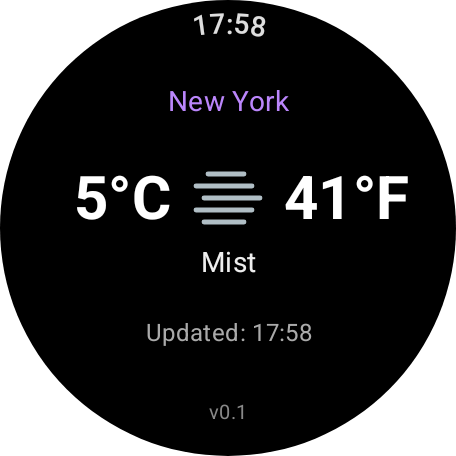
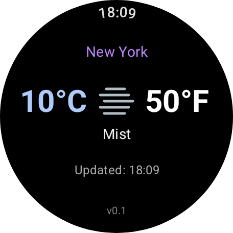
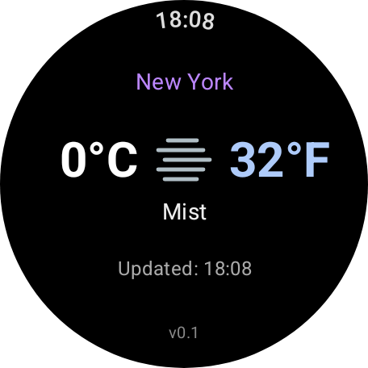

# Freedom Weather

Freedom Weather (because America insists on using Freedom units) is a Wear OS app for those trans-Atlantic folk that, like me, still cannot convert from Celsius to Fahrenheit in their heads. The app is super simple, showing the temperature in Celsius ***and*** Fahrenheit along with the current conditions for your location. It has a tile that can be pinned to the watch face for quick viewing; the main activity shows the same view but with the additional feature of being able to dynamically change the temperature in either C or F, and the both units are updated. Handy if you know want to quickly convert the weather elsewhere, or from another time. 

## Usage
The main activity UI shows the location, temperature, current conditions, and the last updated time:



To change the value of the Celius value, tap the left-side temperature value. The Celsius value will be highlighted in blue; use the crown of the watch to change the value, the Fahrenheit value will automatically update. The same process can be repeated for the Fahrenheit value by tapping the right-side temperature. 




Tapping the current condition icon will revert the readings to the actual temperature for your location.

## Setup & Installation

You can get the latest APK from the [Releases](https://github.com/thefiresonthebird/FreedomWeather/releases) page, or build it yourself. If you build it yourself you will need an OpenWeatherMap API key. 

1.  **Clone the repository**:
    ```bash
    git clone <repository-url>
    ```

2.  **Open in Android Studio**:
    Open the project in the latest version of Android Studio.

3.  **Configure API Key**:
    This project requires a weather API key (e.g., OpenWeatherMap).
    *   Open `local.properties` in the project root.
    *   Add your API key:
        ```properties
        WEATHER_API_KEY=your_api_key_here
        ```

4.  **Build and Run**:
    *   Sync the project with Gradle files.
    *   Select a Wear OS emulator or connected device.
    *   Run the `app` configuration.